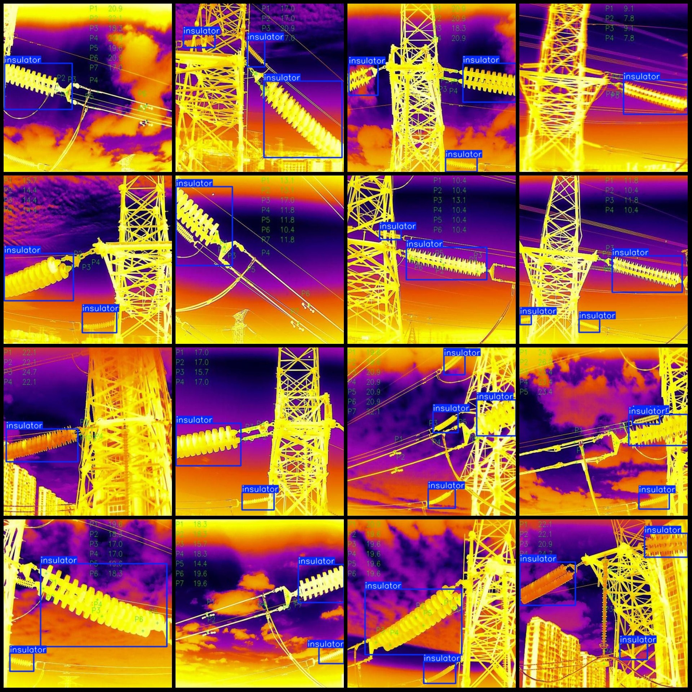
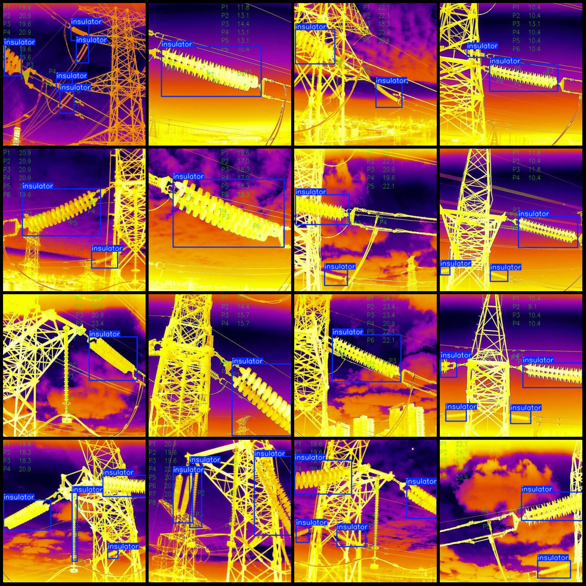

# 420 Images of Infrared Temperature Measurement for Transmission Tower Insulators in VOC+YOLO Format

The dataset format is Pascal VOC format with YOLO format. It does not include split paths and only contains jpg images along with their corresponding VOC format xml files and yolo format txt files.
number of images: 420  
annotation count: 420  
annotation count: 420  
annotationnumber of classes: 1  
annotation class names:["insulator"]  
boxes per class:   
insulator box count = 813  
total boxes: 813  
image resolution: 416x416  
Use annotation tool: labelImg
Annotation rules: draw a rectangle around the class
Important notes: None
Special statement: This dataset does not guarantee the accuracy of the trained model or weight files.
Image preview:
## Images

Here is a pay link on Stripe ( https://buy.stripe.com/3cs8yP7sY87d0vu9AB ). Please contact me lonlonago@foxmail.com after funding $89, and I will send you a complete data files , thank you!

